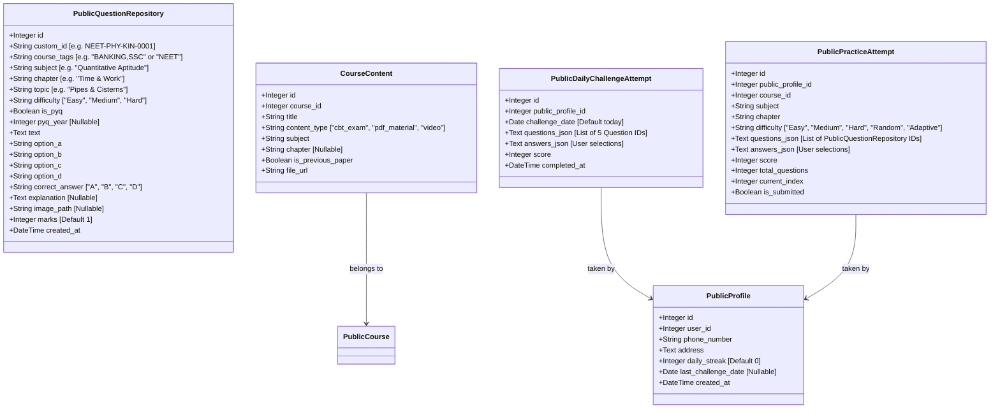

# Senior Developer Implementation Plan: Public Exam Portal (Separate Repository + Daily Streaks + Slim Layout)

This plan outlines the architecture for updating the public exam portal. We will implement a **Separate Public Question Repository** for B2C competitive exams (NEET, UPSC, Banking, SSC, etc.), completely isolated from the B2B school system. We will also add a **Daily Challenge and Streak System**, slim down the layout (header and sidebar), and add quick navigation home actions to the dashboard home page.

---

## Senior Developer Design Decision: Isolated Public Question Repository

We will build a dedicated, separate table for public portal questions.

### Why this is the chosen design:
*   **Domain Isolation:** Avoids cluttering the school K-12 database. Competitive exams use subjects like *Quantitative Aptitude*, *Verbal Reasoning*, and *General Knowledge (GK)*, which do not belong to the school board curriculum.
*   **Aptitude/GK Shared Bank:** Aptitude and GK questions are common across multiple public exams (e.g. Banking, SSC CGL, Railways). A separate repository with `course_tags` (e.g., `'BANKING,SSC'`) allows a single question to be shared across multiple public courses.
*   **Clean Metadata:** Avoids fitting college-graduate level exams into K-12 structures like `class_number` (1 to 12).

---

## Technical Specifications & Architecture

### 1. Database Schema Extensions

We will add the new models in [models.py](file:///c:/exam-app/backend/models.py):



#### SQL Migration Script:
We will write a migration script `migrate_public_repository.py` to run:
```sql
-- Create Public Question Repository table
CREATE TABLE public_question_repository (
    id INT AUTO_INCREMENT PRIMARY KEY,
    custom_id VARCHAR(50) UNIQUE,
    course_tags VARCHAR(255),
    subject VARCHAR(100) NOT NULL,
    chapter VARCHAR(100),
    topic VARCHAR(150),
    difficulty VARCHAR(20) DEFAULT 'Medium',
    is_pyq BOOLEAN DEFAULT FALSE,
    pyq_year INT,
    text TEXT NOT NULL,
    option_a VARCHAR(500),
    option_b VARCHAR(500),
    option_c VARCHAR(500),
    option_d VARCHAR(500),
    correct_answer VARCHAR(10) NOT NULL,
    explanation TEXT,
    image_path VARCHAR(255),
    marks INT DEFAULT 1,
    created_at DATETIME DEFAULT CURRENT_TIMESTAMP
);

-- Join table to link CourseContent (PYQ Exams) to Public Question Repository
CREATE TABLE public_course_content_questions (
    content_id INT NOT NULL,
    public_q_id INT NOT NULL,
    order_index INT NOT NULL DEFAULT 1,
    PRIMARY KEY (content_id, public_q_id),
    FOREIGN KEY (content_id) REFERENCES course_contents(id) ON DELETE CASCADE,
    FOREIGN KEY (public_q_id) REFERENCES public_question_repository(id) ON DELETE CASCADE
);

-- Practice attempts targeting public question repository
CREATE TABLE public_practice_attempts (
    id INT AUTO_INCREMENT PRIMARY KEY,
    public_profile_id INT NOT NULL,
    course_id INT NOT NULL,
    subject VARCHAR(100),
    chapter VARCHAR(100),
    difficulty VARCHAR(20) DEFAULT 'Random',
    questions_json TEXT NOT NULL,
    answers_json TEXT,
    score INT,
    total_questions INT DEFAULT 30,
    is_adaptive BOOLEAN DEFAULT FALSE,
    current_index INT DEFAULT 0,
    start_time DATETIME DEFAULT CURRENT_TIMESTAMP,
    submitted_at DATETIME,
    FOREIGN KEY (public_profile_id) REFERENCES public_profiles(id) ON DELETE CASCADE,
    FOREIGN KEY (course_id) REFERENCES public_courses(id) ON DELETE CASCADE
);

-- Add chapter field to course contents
ALTER TABLE course_contents ADD COLUMN chapter VARCHAR(100) DEFAULT NULL;

-- Add Daily Streak fields to Public Profile
ALTER TABLE public_profiles ADD COLUMN daily_streak INT DEFAULT 0;
ALTER TABLE public_profiles ADD COLUMN last_challenge_date DATE DEFAULT NULL;

-- Create Daily Challenge Attempts table
CREATE TABLE public_daily_challenge_attempts (
    id INT AUTO_INCREMENT PRIMARY KEY,
    public_profile_id INT NOT NULL,
    challenge_date DATE NOT NULL,
    questions_json TEXT NOT NULL,
    answers_json TEXT,
    score INT DEFAULT 0,
    completed_at DATETIME,
    FOREIGN KEY (public_profile_id) REFERENCES public_profiles(id) ON DELETE CASCADE
);
```

---

## 2. Content & Upload Management Workflow

1.  **Dedicated PYQs (1.1):**
    *   Uploaded as `CourseContent` (type `'cbt_exam'`, `is_previous_paper = True`).
    *   Questions are uploaded to the new `PublicQuestionRepository`, tagged with `course_tags = 'NEET'`, `is_pyq = True`, `pyq_year = 2024`.
    *   Linked via `public_course_content_questions` join table.
2.  **General Chapter/Subject Questions (1.2):**
    *   Uploaded to `PublicQuestionRepository` tagged with `subject`, `chapter`, and `course_tags` (e.g. `'NEET'` or `'BANKING,SSC'`).
3.  **Study Materials (2):**
    *   Uploaded as `CourseContent` (type `'pdf_material'` or `'video'`) and tagged with `subject` and `chapter`.

---

## 3. Search, Practice & Daily Streak Engine

### Dynamic Generation (No Manual Admin Setup)
*   Practice exams in the public portal are fully automated and generated on the fly.
*   Admins only maintain the question bank (`PublicQuestionRepository`).

### Practice Modes:
1.  **Chapter Prep:** Filters `PublicQuestionRepository` by `subject`, `chapter`, and matching `course_tags`. Pulls $X$ questions (default 30).
2.  **Subject Prep:** Filters by `subject` and matching `course_tags`. Pulls $X$ questions (default 30).
3.  **Course/Exam Prep (Mock Test):** Filters by matching `course_tags` (e.g., `'NEET'`), pulling a balanced mix of subjects.

> [!NOTE]
> **Adaptive Practice UI Status:** Adaptive backend code and logic will be fully implemented. However, the UI toggle to select "Adaptive Mode" will be disabled/hidden for now. Users will practice using standard difficulty levels or random mixes.

### Daily Challenge & Streak System:
*   **Daily Challenge Generation (`POST /public/challenge/start`):**
    *   Checks the user's enrolled courses to determine focus:
        *   If subscribed to a **Science exam** (NEET, JEE), pulls 5 random science questions (Physics, Chemistry, Biology, Math) from `PublicQuestionRepository`.
        *   If subscribed to an **Arts/Govt/Banking exam** (UPSC, Banking, SSC), pulls 5 random Aptitude, Reasoning, and GK questions.
        *   Otherwise, pulls 5 random general GK and Aptitude questions.
    *   Creates a `PublicDailyChallengeAttempt` and returns the 5 questions (without answers).
*   **Challenge Submission (`POST /public/challenge/submit`):**
    *   Grades the 5 questions.
    *   Saves the attempt and marks `completed_at` as now.
    *   **Updates Streak:**
        *   If `last_challenge_date` was yesterday: `daily_streak += 1`.
        *   If `last_challenge_date` was today: Do not modify streak (already completed).
        *   If `last_challenge_date` was before yesterday or null: Reset/set `daily_streak = 1`.
        *   Update `last_challenge_date` to today's date.
    *   Returns the score, explanation, and new streak count.

---

## 4. Layout & Navigation Optimizations

### Slim Design System
*   **Top Header (`PublicLayout.jsx`):** Height is reduced from `64px` to `50px`. Text font sizes are scaled down, and paddings for nav links and profile buttons are minimized.
*   **Dashboard Sidebar (`PublicDashboard.jsx`):** Sidebar width (`SIDEBAR_W`) is reduced from `260px` to `220px`. The height of sidebar items is reduced (py: 0.8), text size is set to `0.8rem`, and spacing is compacted to maximize screen estate.

### Overview Quick Navigation Actions (Home Actions)
On the dashboard home page (Overview tab), we will display a **Quick Prep Hub** right under the stats panel:
*   A clean grid of card actions with premium icons representing different preparation pathways:
    1.  **Chapter Prep:** Quick action to select a subject/chapter and start practice.
    2.  **Subject Practice:** Quick action to launch a subject-wide mix.
    3.  **Mock Tests:** Launches a full exam mix.
    4.  **Previous Papers (PYQs):** Directly focuses the course tab on the dedicated CBT previous year papers.
    5.  **Study Materials:** Directly navigates to the chapter content/syllabus browser.

*   This allows a user to initiate any learning mode directly from the Home Dashboard instead of digging into sidebars or accordion tabs.

---

## Verification Plan

### Automated Verification
*   Write unit tests in `backend/tests/test_public_practice.py`:
    *   Test dynamic practice generator filters.
    *   Test daily challenge selection logic for science vs. banking courses.
    *   Test daily streak update logic (consecutive days increment, missing a day resets).

### Manual Verification
*   Seed questions across Physics, Chemistry, GK, and Aptitude.
*   Enroll in a NEET course and verify that the Daily Challenge serves Science questions.
*   Enroll in a Banking course and verify that the Daily Challenge serves Aptitude/GK questions.
*   Simulate completing the challenge and verify the streak increments.
